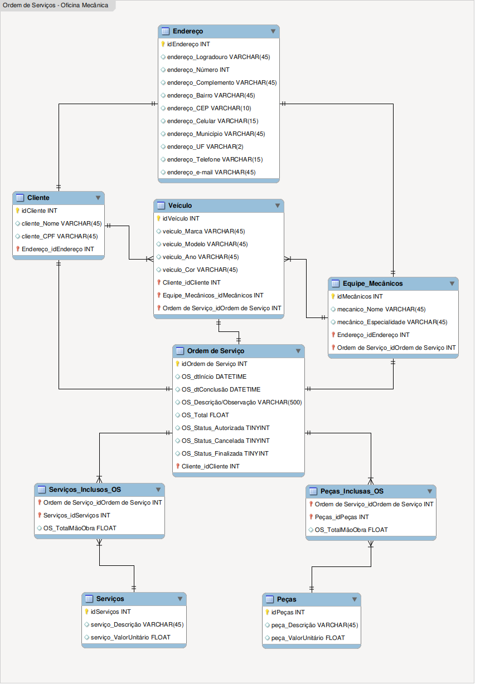

# Construindo um Esquema Conceitual_Oficina Mecânica
 
 *Esquema entidade relacionamento do zero.*

 2º Desafio DIO Database Experience

>**Descrição do Desafio**

        Criar um esquema conceitual do zero. A partir da narrativa fornecida.

        O   esquema deverá ser adicionado a um repositório do Github para futura avaliação do desafio de projeto. Adicione ao Readme a descrição do projeto conceitual para fornecer o contexto sobre seu esquema.
        Objetivo:

        Cria o esquema conceitual para o contexto de oficina com base na narrativa fornecida
        
        Narrativa:

        Sistema de controle e gerenciamento de execução de ordens de serviço em uma oficina mecânica.
        
        Clientes levam veículos à oficina mecânica para serem consertados ou para passarem por revisões  periódicas.
       
        Cada veículo é designado a uma equipe de mecânicos que identifica os serviços a serem executados e preenche uma OS com data de entrega.
        
        A partir da OS, calcula-se o valor de cada serviço, consultando-se uma tabela de referência de mão-de-obra.
        
        O valor de cada peça também irá compor a OSO cliente autoriza a execução dos serviços
        A mesma equipe avalia e executa os serviços
        Os mecânicos possuem código, nome, endereço e especialidade.
        
        Cada OS possui: n°, data de emissão, um valor, status e uma data para conclusão dos trabalhos.

**Fiz o máximo para seguir/entender o esquema que foi pedido, achei interessante criar uma entidade de endereço a parte pois posso utilizá-la tanto para cliente quanto para equipe de mecânicos e posteriormente se o sistema expandi pode ser usado para demais empregados, fornecedore etc...**

