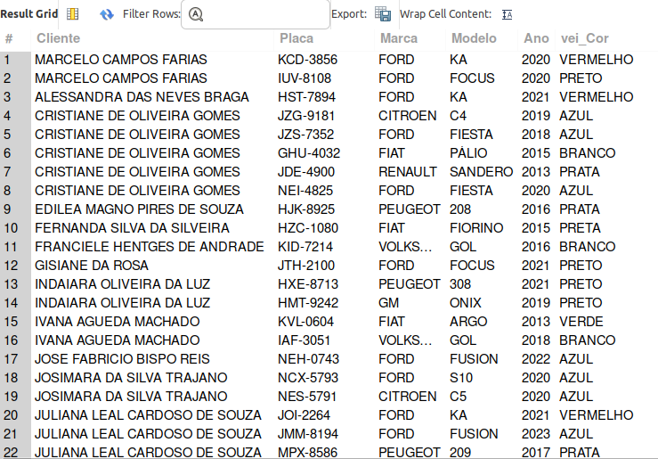
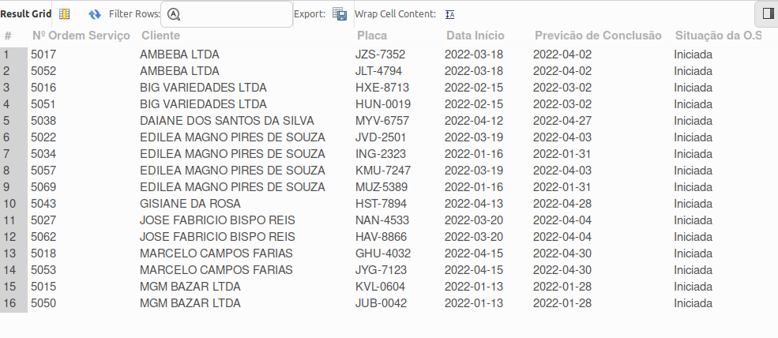
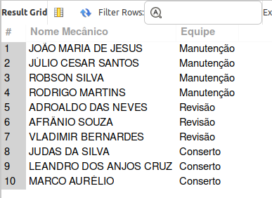
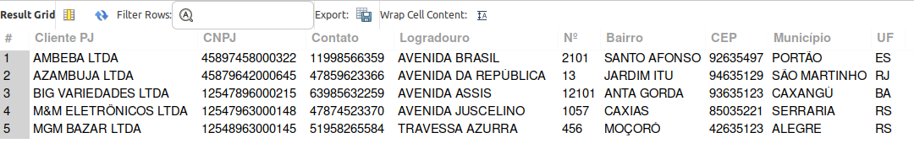
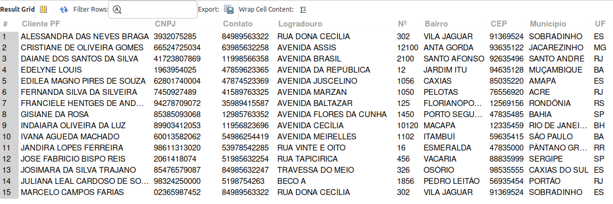
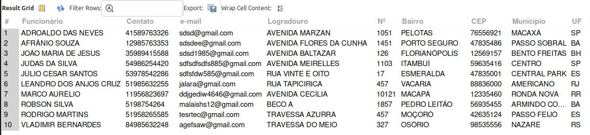
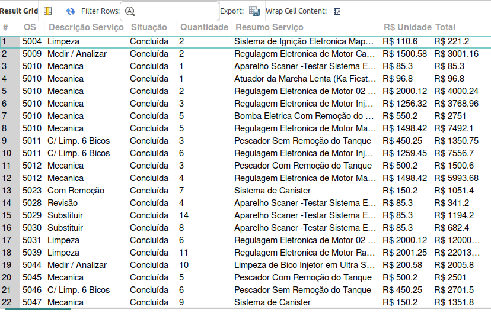
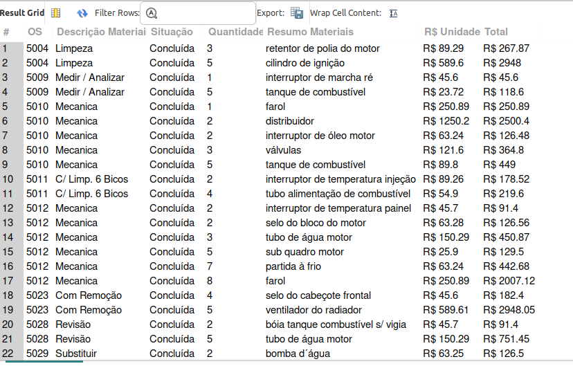
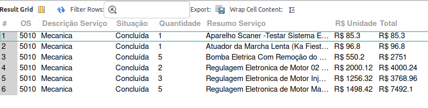
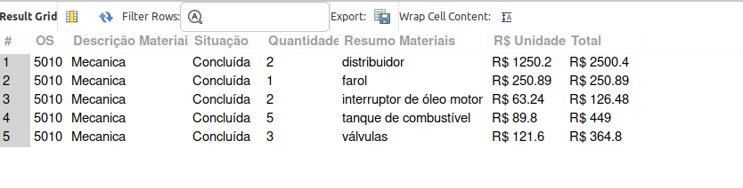

### Desafio Banco de Dados - Oficina Mecânia
#### Bootcamp Database Experience - DIO

>.
> Seduindo o que aprendi no curso e que fiz juntamente com a Juliana Mascarenhas no primeiro desafio do e-commerce, iniciei pelo esquema conceitual e agora consegui entender que se este ertiver bem feito, os scripts em SQL ficam muito práticos de serem feitos.
> 
> *As instruções do desafio eram as seguintes:*
>.
>>
>> **Narrativa:**
>>
>> * Sistema de controle e gerenciamento de execução de ordens de serviço em uma oficina mecânica.
>> * Clientes levam veículos à oficina mecânica para serem consertados ou para passarem por revisões  periódicas.
>> * Cada veículo é designado a uma equipe de mecânicos que identifica os serviços a serem executados e preenche uma OS com data de entrega.
>> * A partir da OS, calcula-se o valor de cada serviço, consultando-se uma tabela de referência de mão-de-obra.
>> * O valor de cada peça também irá compor a OSO cliente autoriza a execução dos serviços
>> * A mesma equipe avalia e executa os serviços
>> * Os mecânicos possuem código, nome, endereço e especialidade.
>> * Cada OS possui: n°, data de emissão, um valor, status e uma data para conclusão dos trabalhos.
>>
>>.
>>> #### Como desenvolvi:
>>> **Além de seguir a narrativa e o que já tínhhamos feito em relação a oficina mecânica, resolvi tentar colocar todos os dados de endereço e contato em uma tabela a parte, e utilizar a mesma para os mecânicos(funcionários), para os clientes e se o banco de dados precisar em algum momento cadastrar fornecedor posso utilizar a mesma tabela. 
>>> Inicialmente não tinha entendido bem como teria acesso a estes dados juntos, mas no final entendi que usando JOIN e chave estrangeira isso se resolve.
>>> Com isso diminui a repetição de dados em várias tabelas.**
>>>.


##### FIZ AS QUERY'S PARA RESPONDER AS SEGUINTES QUESTÕES:

>*1) 	Consulta completa dos dados do Veículo e nome do Cliente:*
```sql
SELECT
    cli_Cliente 'Cliente',
    vei_Placa 'Placa',
    vei_Marca 'Marca',
    vei_Modelo 'Modelo',
    vei_Ano 'Ano',
    vei_Cor
FROM
    Cliente
        INNER JOIN
    Veiculo ON idCliente = idCli_Vei
GROUP BY 
    cli_Cliente,
    idVeiculo;
```


>*2)   Consultando Ordens de Serviço em Aberto por cliente:*
```sql
SELECT 
    idOrdemServico 'Nº Ordem Serviço',
    cli_Cliente 'Cliente',
    vei_Placa 'Placa',
    OS_Inicio 'Data Início',
    OS_Conclusao 'Previcão de Conclusão',
    OS_Status 'Situação da O.S'
FROM
    OrdemServico
        INNER JOIN
    Cliente ON idCliente = idCli_OS
		INNER JOIN Veiculo ON idOrdSer_Vei=idOrdemServico
WHERE OS_Status = 'Iniciada'
GROUP BY 
    idOrdemServico,
    cli_Cliente,
    vei_Placa
ORDER BY cli_Cliente;
```

>*3) Consultar as Ordens de Serviço 'Em Análise' por EQUIPE:*
```sql
SELECT 
    equip_Nome 'Equipe',
    equip_EspEquipe 'Tipo Serviço',
    idOrdemServico 'Ordem de Serviço',
    OS_Inicio 'Início',
    OS_Descricao 'Descrição',
    OS_Conclusao 'Previsão Conclusão',
    OS_Status 'Situação'
FROM
    Equipe
        INNER JOIN
    OrdemServico ON idEqui_OS = idEquipe
WHERE
    OS_Status = 'Em Análise'
ORDER BY equip_Nome;
```

>*4) Ordens de Serviço 'AUTORIZADA' pelo cliente para passar à equipe responsável:*
```sql
SELECT 
    equip_Nome 'Equipe',
    equip_EspEquipe 'Tipo Serviço',
    idOrdemServico 'Ordem de Serviço',
    OS_Inicio 'Início',
    OS_Descricao 'Descrição',
    OS_Conclusao 'Previsão Conclusão',
    OS_Status 'Situação'
FROM
    Equipe
        INNER JOIN
    OrdemServico ON idEqui_OS = idEquipe
WHERE
    OS_Status = 'Autorizada'
ORDER BY equip_Nome;
```

>*5)Lista de mecânicos por equipe:*
```sql
SELECT 
    mec_NomeCompleto 'Nome Mecânico', 
    equip_Nome 'Equipe'
FROM
    Mecanico,
    Equipe
WHERE
    idMecanico = idMec_Equip
GROUP BY 
	equip_Nome,
    mec_NomeCompleto
ORDER BY 
	equip_Nome;
```

>*6) Listagem Geral de CLIENTES "PESSOA JURÍDICA":*
```sql
SELECT 
    cli_Cliente 'Cliente PJ',
    cli_CNPJ 'CNPJ',
    end_Celular 'Contato',
    end_Logradouro 'Logradouro',
    end_Numero 'Nº',
    end_Bairro 'Bairro',
    end_CEP 'CEP',
    end_Municipio 'Município',
    end_UF 'UF'
FROM
    Cliente
        INNER JOIN
    Endereco ON idEndereco = idEndCli
WHERE cli_Tipo='Pessoa Jurídica'
ORDER BY cli_Cliente;
```

>*7) Listagem Geral de CLIENTES "PESSOA FÍSICA":*
```sql
SELECT 
    cli_Cliente 'Cliente PF',
    cli_CPF 'CNPJ',
    end_Celular 'Contato',
    end_Logradouro 'Logradouro',
    end_Numero 'Nº',
    end_Bairro 'Bairro',
    end_CEP 'CEP',
    end_Municipio 'Município',
    end_UF 'UF'
FROM
    Cliente
        INNER JOIN
    Endereco ON idEndereco = idEndCli
WHERE cli_Tipo='Pessoa Física'
ORDER BY cli_Cliente;
```

>*8) Lista com dados completos dos funcionários:*
```sql
SELECT 
    mec_NomeCompleto 'Funcionário',
    end_Celular 'Contato',
    end_email 'e-mail',
    end_Logradouro 'Logradouro',
    end_Numero 'Nº',
    end_Bairro 'Bairro',
    end_CEP 'CEP',
    end_Municipio 'Município',
    end_UF 'UF'
FROM
    Mecanico
        INNER JOIN
    Endereco ON idEndereco = idEnd_Mec
ORDER BY mec_NomeCompleto;
```

>*9)Faturamento dos Serviço por Ordem de Serviços 'CONCLUÍDA'*
```sql
SELECT 
	idOrdemServico 'OS',
    OS_Descricao 'Descrição Serviço',
    OS_Status 'Situação',
    servOS_Quantidade 'Quantidade',
    serv_Descricao 'Resumo Serviço',
    concat('R$',' ',serv_ValorUnitario) 'R$ Unidade',
    concat('R$',' ', round((servOS_Quantidade * serv_ValorUnitario),2)) AS Total
FROM OrdemServico
INNER JOIN Servicos_OS ON idOrdemServico=idOrdSer_ServicosOS
INNER JOIN Servicos ON idServicos=idServicos_OS
WHERE OS_Status='Concluída'
GROUP BY 
	idOrdemServico,
	OS_Descricao,
    OS_Status,
    servOS_Quantidade,
    serv_Descricao,
    serv_ValorUnitario
ORDER BY 
	idOrdemServico;
```

>*10)Faturamento dos Materiais por Ordem de Serviços 'CONCLUÍDA':*
```sql
SELECT 
    idOrdemServico 'OS',
    OS_Descricao 'Descrição Materiais',
    OS_Status 'Situação',
    matOS_Quantidade 'Quantidade',
    mat_Descricao 'Resumo Materiais',
    concat('R$',' ',mat_ValorUnitario) 'R$ Unidade',
    concat('R$',' ', round((matOS_Quantidade * mat_ValorUnitario),2)) AS Total
FROM OrdemServico
INNER JOIN Materiais_OS ON idOrdemServico=idOrdSer_MateriaisOS
INNER JOIN Materiais ON idMateriais=idMateriais_MateriaisOS
WHERE OS_Status='Concluída'
GROUP BY 
	idOrdemServico,
	OS_Descricao,
    OS_Status,
    matOS_Quantidade,
    mat_Descricao,
    mat_ValorUnitario
ORDER BY 
	idOrdemServico;
```

>*11) Faturamento em MÃO-DE-OBRA (SERVIÇOS) O.S Nº 5010:*
```sql
SELECT 
    idOrdemServico 'OS',
    OS_Descricao 'Descrição Serviço',
    OS_Status 'Situação',
    servOS_Quantidade 'Quantidade',
    serv_Descricao 'Resumo Serviço',
    concat('R$',' ',serv_ValorUnitario) 'R$ Unidade',
    concat('R$',' ', round((servOS_Quantidade * serv_ValorUnitario),2)) AS Total
FROM OrdemServico
INNER JOIN Servicos_OS ON idOrdemServico=idOrdSer_ServicosOS
INNER JOIN Servicos ON idServicos=idServicos_OS
WHERE OS_Status='Concluída' AND idOrdemServico='5010'
GROUP BY 
	idOrdemServico,
	OS_Descricao,
    OS_Status,
    servOS_Quantidade,
    serv_Descricao,
    serv_ValorUnitario
ORDER BY 
	idOrdemServico;
```

>*12) Faturamento em MATERIAIS (PEÇAS) O.S Nº 5010:*
```sql
SELECT 
    idOrdemServico 'OS',
    OS_Descricao 'Descrição Materiais',
    OS_Status 'Situação',
    matOS_Quantidade 'Quantidade',
    mat_Descricao 'Resumo Materiais',
    concat('R$',' ',mat_ValorUnitario) 'R$ Unidade',
    concat('R$',' ', round((matOS_Quantidade * mat_ValorUnitario),2)) AS Total
FROM OrdemServico
INNER JOIN Materiais_OS ON idOrdemServico=idOrdSer_MateriaisOS
INNER JOIN Materiais ON idMateriais=idMateriais_MateriaisOS
WHERE OS_Status='Concluída' AND idOrdemServico = '5010'
GROUP BY 
	idOrdemServico,
	OS_Descricao,
    OS_Status,
    matOS_Quantidade,
    mat_Descricao,
    mat_ValorUnitario
ORDER BY 
	idOrdemServico;
```



_Obrigada DIO!!!_