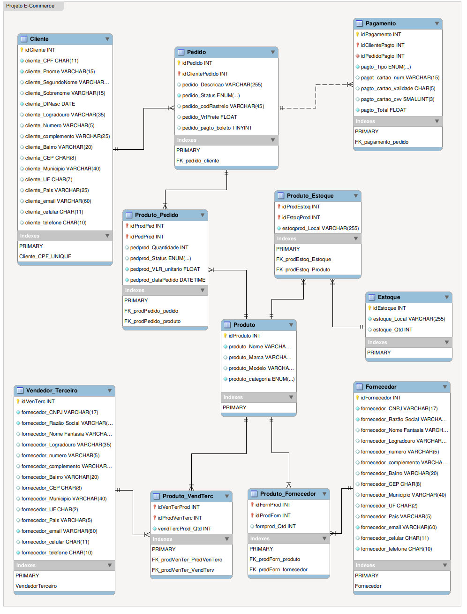
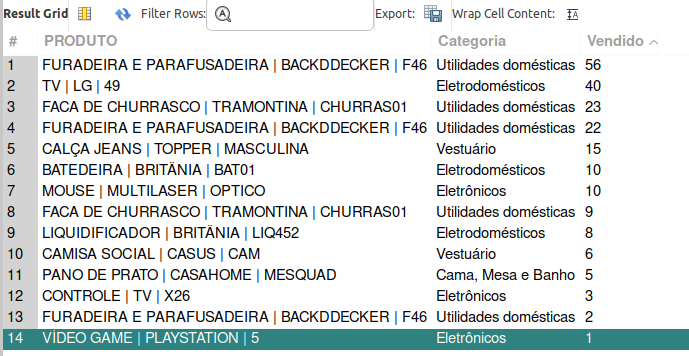
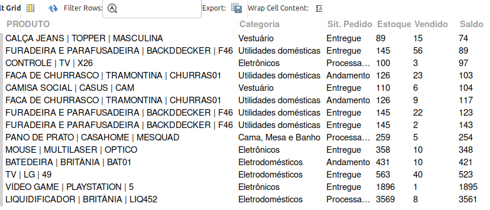
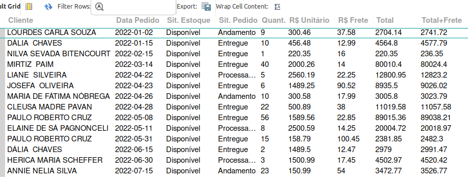
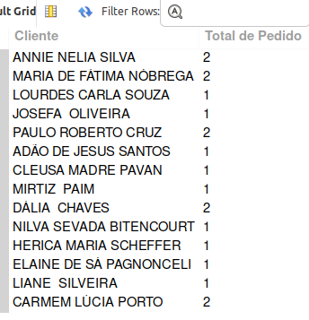

### **Desafio de Projeto Lógico para Banco de Dados**

### **E-commerce**

>**Descrição do Desafio**
>Replique a modelagem do projeto lógico de banco de dados para o cenário de e-commerce. Fique atento as definições de chave primária e estrangeira, assim como as constraints presentes no cenário modelado. Perceba que dentro desta modelagem haverá relacionamentos presentes no modelo EER. Sendo assim, consulte como proceder para estes casos. Além disso, aplique o mapeamento de modelos aos refinamentos propostos no módulo de modelagem conceitual 
**...**

###**Descrição de como cumpri o desafio**

1. Fiz e refinei o modelo conceitual conforme imagem abaixo:



######QUAL PRODUTO MAIS VENDIDO?
```sql

SELECT 
    CONCAT(produto_Nome, ' | ', produto_Marca, ' | ', produto_Modelo) 'PRODUTO',
    produto_categoria 'Categoria',
    pedprod_Quantidade Vendido
FROM
    Fornecedor f 
INNER JOIN Produto_Fornecedor ON idFornecedor=idFornProd
INNER JOIN Produto ON idProduto=idProdForn
INNER JOIN Produto_Pedido ON idProduto=idProdPed
INNER JOIN Pedido ON idPedido = idPedProd
WHERE
    pedprod_Status <> 'Sem Estoque'
        AND pedido_Status <> 'Cancelado'
ORDER BY Vendido DESC;
```


######CALCULANDO SALDO DO ESTOQUE:

```sql
SELECT 
    CONCAT(produto_Nome, ' | ', produto_Marca, ' | ', produto_Modelo) 'PRODUTO',
	produto_categoria 'Categoria',
    pedido_Status 'Sit. Pedido',
    fornprod_Qtd 'Estoque',
    pedprod_Quantidade 'Vendido',
    ROUND((fornprod_Qtd - pedprod_Quantidade), 2) AS Saldo
FROM
    Fornecedor f 
INNER JOIN Produto_Fornecedor ON idFornecedor=idFornProd
INNER JOIN Produto ON idProduto=idProdForn
INNER JOIN Produto_Pedido ON idProduto=idProdPed
INNER JOIN Pedido ON idPedido = idPedProd
WHERE
    pedprod_Status <> 'Sem Estoque'
        AND pedido_Status <> 'Cancelado'
ORDER BY Saldo;
```


######CALCULANDO TOTAL DO PEDIDO (COMPRAS + FRETE)
```sql
SELECT 
    CONCAT(cliente_Pnome, ' ', cliente_SegundoNome, ' ', cliente_Sobrenome) 'Cliente',
    pedprod_dataPedido 'Data Pedido',
    pedprod_Status 'Sit. Estoque',
    pedido_Status 'Sit. Pedido',
    pedprod_Quantidade 'Quant.',
    pedprod_VLR_unitario 'R$ Unitário',
    pedido_VrlFrete 'R$ Frete',
    ROUND((pedprod_Quantidade * pedprod_VLR_unitario),2) AS 'Total',
    ROUND(((pedprod_Quantidade * pedprod_VLR_unitario) + pedido_VrlFrete),2) AS 'Total+Frete'
FROM
    Produto_Pedido pp 
INNER JOIN 
    Pedido p ON idPedido = idPedProd
INNER JOIN
    Cliente c ON idClientePedido = idCliente
WHERE
    pedprod_Status <> 'Sem Estoque'
        AND pedido_Status <> 'Cancelado'
GROUP BY 
		cliente_Pnome,
		cliente_SegundoNome,
        cliente_Sobrenome,
        pedprod_dataPedido,
        pedprod_Status,
        pedido_Status,
        pedprod_Quantidade,
        pedprod_VLR_unitario,
        pedido_VrlFrete
ORDER BY pedprod_dataPedido;
```


######TOTAL DE PEDIDOS DE 04/2022
```sql
SELECT 
    CONCAT(cliente_Pnome, ' ', cliente_SegundoNome, ' ', cliente_Sobrenome) 'Cliente',
    pedprod_dataPedido 'Data Pedido',
    pedprod_Status 'Sit. Estoque',
    pedido_Status 'Sit. Pedido',
    pedprod_Quantidade 'Quant.',
    pedprod_VLR_unitario 'R$ Unitário',
    pedido_VrlFrete 'R$ Frete',
    ROUND((pedprod_Quantidade * pedprod_VLR_unitario),2) AS 'Total',
    ROUND(((pedprod_Quantidade * pedprod_VLR_unitario) + pedido_VrlFrete),2) AS 'Total+Frete'
FROM
    Produto_Pedido pp
INNER JOIN
    Pedido p ON idPedido = idPedProd
INNER JOIN
    Cliente c ON idClientePedido = idCliente
WHERE
    pedprod_Status <> 'Sem Estoque'
        AND pedido_Status <> 'Cancelado'
        AND pedprod_dataPedido > '2022-03-31'
        AND pedprod_dataPedido < '2022-05-01'
ORDER BY pedprod_dataPedido;

```


######QUANTOS PEDIDOS POR CLIENTE?
```sql
SELECT 
    CONCAT(cliente_Pnome, ' ', cliente_SegundoNome, ' ', cliente_Sobrenome) 'Cliente',
    COUNT(*) AS 'Total de Pedido'
FROM
    Pedido,
    Cliente
WHERE
    idClientePedido = idCliente
GROUP BY idClientePedido , cliente_Pnome;
```


###### DEMAIS SCRIPTS

```sql
--TABLE CLIENTE
    -- consultando Nome Completo dos Cliente e id:
SELECT 
    idCliente IDCliente,
    CONCAT(cliente_Pnome,
            ' ',
            cliente_SegundoNome,
            ' ',
            cliente_Sobrenome) 'Cliente'
FROM
    Cliente c;

*****************************************

-- CALCULAR IDADE DOS CLIENTES

SELECT 
CONCAT(cliente_Pnome, ' ', cliente_SegundoNome, ' ', cliente_Sobrenome) 'Cliente',
cliente_DtNasc 'Data de Nascimento', 
year(now()) - year(cliente_DtNasc) 'Idade'
FROM Cliente;

******************************************

-- TABLE PRODUTO_PEDIDO
-- consultando data do pedido, disponibilidade do produto, quantidade pedida e valor unitário
-- Sem mostrar produtos indispoíveis "Sem Estoque"
SELECT 
    pedprod_dataPedido 'Data Pedido',
    pedprod_Status 'Disponibilidade',
    pedprod_Quantidade 'Quantidade',
    pedprod_VLR_unitario 'Valor Unitário'
FROM
    Produto_Pedido pp
WHERE
    pedprod_Status <> 'Sem Estoque'
ORDER BY pedprod_dataPedido;

*******************************************

-- TABLE PEDIDO
-- consultando idPedido, idCliente, situação do pedido, valor do frete
-- sem mostrar os pedidos cancelados
SELECT 
    idPedido IDPed,
    idClientePedido IDCli,
    pedido_Status Situação_Pedido,
    pedido_VrlFrete ValorFrete
FROM
    Pedido p
WHERE
    pedido_Status <> 'Cancelado';

*******************************************

/* Aqui eu usei o INNER JOIN para unir as principais informações de 3 tabelas e assim obter as
principais informações de uma compra, desde o dado do cliente até as informações de preço, frete e situação do pedido e do estoque do produto*/

SELECT 
    CONCAT(cliente_Pnome,
            ' ',
            cliente_SegundoNome,
            ' ',
            cliente_Sobrenome) 'Cliente',
    pedprod_dataPedido 'Data Pedido',
    pedprod_Status 'Disp.',
    pedido_Status 'Sit. Pedido',
    pedprod_Quantidade 'Quant.',
    pedprod_VLR_unitario 'Valor Unitário',
    pedido_VrlFrete 'Valor Frete'
FROM
    Produto_Pedido pp
        INNER JOIN
    Pedido p ON idPedido = idPedProd
        INNER JOIN
    Cliente c ON idClientePedido = idCliente
WHERE
    pedprod_Status <> 'Sem Estoque'
        AND pedido_Status <> 'Cancelado';

*****************************************

-- Total vendido por ano e mês
SELECT
  round(SUM(pedprod_VLR_unitario),2) AS 'RESUMO VENDAS' 
FROM
  Produto_Pedido
GROUP BY
  YEAR(pedprod_dataPedido), 
  MONTH(pedprod_dataPedido);

******************************************

-- TABLE FORNECEDOR
SELECT 
    fornecedor_CNPJ 'CNPJ',
	fornecedor_RazaSocial 'Razão Social',
	fornecedor_NomeFantasia 'Nome Fantasia',
    fornecedor_Municipio 'Município',
    fornecedor_UF 'UF',
    fornecedor_telefone 'Contato'
FROM
    Fornecedor f;

*******************************************

-- RELAÇÃO GERAL ENTRE FORNECEDOR/PRODUTO/ESTOQUE
SELECT 
    fornecedor_CNPJ 'CNPJ',
	fornecedor_RazaSocial 'Fornecedor',
	fornecedor_NomeFantasia 'Nome Fantasia',
    fornecedor_Municipio 'Município',
    fornecedor_UF 'UF',
    fornecedor_telefone 'Contato',
    fornprod_Qtd 'Qtd. Estoque',
    produto_Nome 'Produto',
	produto_Marca 'Marca',
	produto_Modelo 'Modelo',
	produto_categoria 'Categoria'
FROM
    Fornecedor f 
INNER JOIN Produto_Fornecedor ON idFornecedor=idFornProd
INNER JOIN Produto ON idProduto=idProdForn;
    
******************************************

-- RELAÇÃO DA QUANTIDADE DE PRODUTO EM ESTOQUE
SELECT 
    CONCAT(produto_Nome, produto_Marca, produto_Modelo) 'PRODUTO',
	produto_categoria 'Categoria',
    fornprod_Qtd 'Qtd. Estoque',
    fornecedor_RazaSocial 'Fornecedor',
	fornecedor_Municipio 'Município',
    fornecedor_UF 'UF',
    fornecedor_telefone 'Contato'    
FROM
    Fornecedor f 
INNER JOIN Produto_Fornecedor ON idFornecedor=idFornProd
INNER JOIN Produto ON idProduto=idProdForn
ORDER BY produto_Nome, fornprod_Qtd;

-- ***************************************

-- RELAÇÃO NOME PRODUTO/ NOME FORNECEDOR
SELECT 
    CONCAT(produto_Nome, ' | ',produto_Marca, ' | ', produto_Modelo) 'Produto/Marca/Mod.',
	fornecedor_RazaSocial 'Fornecedor'
FROM
    Fornecedor f, Produto p, Produto_Fornecedor
WHERE idFornProd=idProduto
GROUP BY 
    produto_Nome,
    produto_Marca,
    produto_Modelo,
	fornecedor_RazaSocial
ORDER BY produto_Nome;
