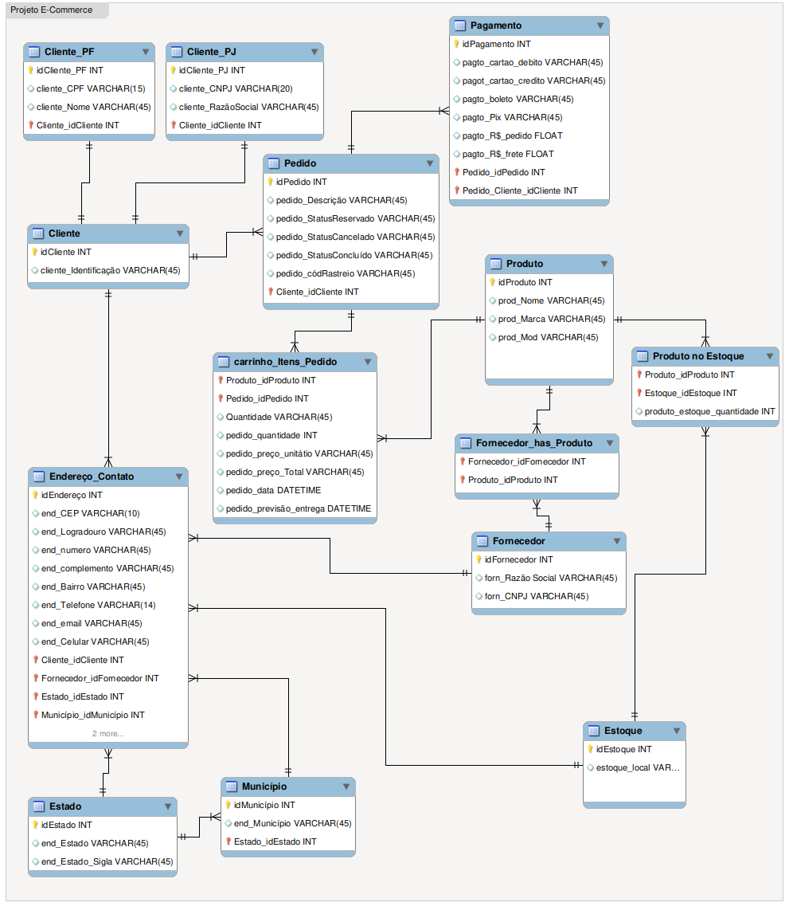

# e-commerce

 **Refinando um Projeto Conceitual de Banco de Dados – E-COMMERCE**

 *1º Desafio Bootcamp Database Experience*

 Aprendi bastante, mas ainda estou no começo, a jornada até aqui foi muito teórica, mas já sei que gosto muito de trabalhar com dados, e pra isso preciso saber mais sobre banco de dados.

 Quanto a diagrama de entidade e relacionamento me pareceu durante as aulas algo imensamente complicado, mas no fim não foi tão difícil, mas acredito que eu consiga visualizar melhor as relações quanto já tenho as tabelas criadas, ou pode ser apenas falta de costume.

 